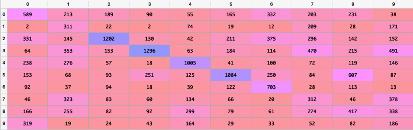
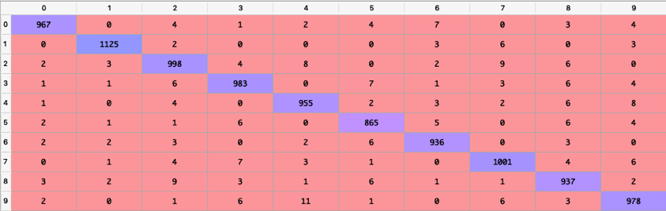

# Handwritten-Digit-Classification-using-Majority-Voting-Classifier

## Introduction
Human Visual System is one of the wonders of the Artificial Intelligence world, as it provides the precision and perception capabilities that even a computer cannot replicate. For example, consider the following sequence of handwritten digits:

 

It can be safely assumed that most of the people can effortlessly recognize those digits as 504192. But this is not the case for a computer program, as it needs substantial number of features for each digit in the image, in order to successfully classify the digits from 0…9. 
Recognizing handwritten digits is not at all easy and this becomes apparent when we try implementing handwritten digit recognition in a traditional computer program that is by hardcoding ‘n’ number of approaches and features together [6]. What at first seemed easy, such as recognizing a digit such as ‘6’ becomes extremely difficult to code. Simple rules such as ‘6’ having a loop in the bottom and not at top, suddenly become difficult to express algorithmically. Hence, when we try to create such rules, we can get overwhelmed by the sheer range of rules that can be introduced ove features of a single digit such as ‘6’.
A more doable approach is by using various features associated with each digit, we can train a Machine Learning model such as Support Vector Machine (SVM) to recognize and classify the handwritten digits. This is a more effective approach as we can train a model once, based on the predefined samples of digits and then use the model to classify a new handwritten digit ‘n’ number of times.

### The MNIST Dataset
The MNIST Dataset (Modified National Institute of Standards and Technology) is a large dataset of handwritten digits that is widely used for training and testing in field of Machine Learning. The MNIST Dataset contains 60000 training images & 10000 testing images. Furthermore, each image is a black & white image from the NIST dataset, that is anti-aliased and normalized to fit a bounding box of 28x28 size. A sample collection of images from the MNIST dataset can be represented as follows:
 

### The USPS Dataset	 
The USPS Dataset (United States Postal Service) is a dataset of handwritten digits that is used as a testing dataset for this project. It contains 2000 image samples for each digit starting from 0 to 9. Each image is scaled at a resolution of 100 PPI and normalized to fit a bounding box of 28x28 size. A row of sample image for each digit can be represented as follows:

 

## Classification using Logistic Regression
### Introduction
Logistic regression is a fundamental machine learning algorithm that uses a linear weighted combination of features and generate probability-based prediction on different classes. As we have to implement a model that can predict values for digits from 0 to 9, we are using a Multinomial Logistic Regression i.e. one with multiple outputs, each of which is used to predict a single output class.
In a Multinomial Logistic Regression, each summation node uses its own set of weights to scale the inputs and sum them together. The outputs of these summations are then passed to a SoftMax function, which normalized each output node based on the sum of all the unnormalized nodes.

 

### One Hot Vector Encoding
One Hot Vector Encoding is a technique used to convert categorical data to numerical representation. Categorical data is the labeled data, used to directly train models. But not all models can use Categorical data as a input, hence in such situations, we have to use One Hot Vector Encoding to convert a categorical data to its numerical form [8].
For example, in a model that can classify colors between ‘red’, ‘blue’ & ‘green’, we can convert these color class labels to One Hot Vector as follows:

 

### SoftMax Function
SoftMax is an activation function that uses the concept of mean and summation of all the values the generated input. It is most frequently used in classification [9]. SoftMax provides large output if the score is large and provides small output if the score is small. As summation is involved in SoftMax Function, we use One Hot Vector Encoding to convert labels before providing input to SoftMax. The generalized equation used by SoftMax is as follows:

 
Where   is the output value Y of a training model.
### Loss Function & Gradient
Cross-entropy loss function or log loss function is used to measure the performance of a classification model whose input probability value is between 0 & 1. Here, as the problem needs a multi class solution i.e. from 0…9, we are using a variation of Cross Entropy loss function that uses a negative log-likelihood function to calculate error. Hence, we apply log function to the likelihood function of observations as follows:

 
Now in order to update the weights of the model, we have to use the gradient descent method along with the loss function. The gradient descent method involves calculating the derivative of squared error function with respect to the weights of the model. This is called as Backpropagation. Hence, the basis gradient descent formula is used for the operation: 

 
Where y is the output of the model & t is the target value vector.
### Hyperparameter Tuning & Results

In order to extract maximum correct output from the model, we have tried to tune following hyperparameters as follows:
* **Learning Rate:** The rate at which the model reaches to its optimal value. In other words, learning rate is the rate at which the neural network updates it weights & other parameters. Low learning rate will slow down the learning process & increases the training time of the model, whereas high learning rate will speed up the learning process, but on the other hand it is possible that model may miss its target value.
* **Number of Iterations:** An iteration can be defined as one run of the model, in a forward & backward manner, over the entire training dataset by the training model. Too less iterations will cause under fitting of the data into the model, whereas too many iterations will cause the model to overfit the data provided. We should ideally increase the number of iterations until the loss stops decreasing, even when test accuracy increasing.

Hence, after tuning & testing the model, the optimal hyperparameter values are:
* Learning Rate: 0.00001 
* Number of Iterations: 200

Based on these parameters, the graph for validation converged as follows:

 
In order to get an idea of True Positive & False Positive values predicted by our Logistic Regression model, we have calculated following Confusion Matrix:

 

 
The final values for average accuracy based on the confusion matrix are as follows:
* For MNIST Dataset: **90.77 %**
* For USPS Dataset: **35.52 %**

## Classification using Multilayer Neural Network
### Introduction
Artificial Neural Networks, also abbreviated as ANN, are build based on the concept of Human Brain. Like the human brain, the ANN is comprised of n number of neurons that work together to model complex pattern & prediction problems. 
For any ANN architecture, there is one input layer, one or more than one hidden layer & one output layer. The multiple hidden layers are used to determine distinctive patterns in the data taken as input. This in turn increases the accuracy of the neural model. Weights ‘W’ is a concept that is used to determine the importance of each neuron in the network. 
Hence more the weight associated with a neuron, more important it is for generating the required output. In order to increase the efficiency of the neural network, we need to adjust weights assigned to every edge connecting two neurons in the network. 
### Example
Now let's try to understand some key points of a simple neural network using the figure in the article written by Jahnavi Mahanta,
 

 
In the figure above, the X1, X2 & X3 together comprise of the input layer. Similarly, H1 & H2 are the neurons in the hidden layer & finally O3 is the output layer. Moreover, W1 to W8 are all the weights assigned to each edge of the Neural Network such that;
 

 
Where F = W1*X1 + W2*X2 + W3*X3
### Hyperparameter Tuning & Results

In order to extract maximum correct output from the model, we have tried to tune following hyperparameters as follows:
* **Number of nodes in a Hidden Layer:** It represents the number of neurons in the nth hidden layer.
* **Activation function:** Activation Functions are used by Neural Networks as an approximation function from one layer to another. Activation Functions work to introduce nonlinearity in the models. One of the most used function is the rectifier activation function ‘relu’. Also ‘sigmoid’ function is used in neural networks making binary predictions, whereas ‘softmax’ function is used in neural networks making multi class predictions.
* **Alpha:** It is a L2 penalty (regularization term) parameter.
* **Optimization Function:** Optimization Function is a mechanism used to reduce error by updating weights of the input in a neural network. One of the most used optimization functions is the Gradient Descent. 
* **Tolerance:** It is the tolerance level for the optimization & error value. When the loss is not improving any more even after updating the weights, convergence is considered to be reached and training stops.
* **Learning Rate:** The rate at which the model reaches to its optimal value. In other words, learning rate is the rate at which the neural network updates it weights & other parameters. Low learning rate will slow down the learning process & increases the training time of the model, whereas high learning rate will speed up the learning process, but on the other hand it is possible that model may miss its target value.
* **Number of Iterations:** An iteration can be defined as one run of the model, in a forward & backward manner, over the entire training dataset by the training model. Too less iterations will cause under fitting of the data into the model, whereas too many iterations will cause the model to overfit the data provided. We should ideally increase the number of iterations until the loss stops decreasing, even when test accuracy increasing.

 
Based on these parameters, the graph for validation converged as follows:
Hence, after tuning & testing the model, the optimal hyperparameter values are:
* Number of nodes in a Hidden Layer: 50
* Activation function: 'relu'
* Number of Iterations: 100
* Alpha: 1e-4
* Optimization Function: 'sgd'
* Tolerance: 1e-4
* Learning Rate: 0.1

In order to get an idea of True Positive & False Positive values predicted by our Neural Network model, we have calculated following Confusion Matrix:

 

 
The final values for average accuracy based on the confusion matrix are as follows:
* For MNIST Dataset: **97.42 %**
* For USPS Dataset: **45.72 %**

## Classification using Random Forest

### Introduction
Decision Trees are one of the most used classifiers in the field of data mining. This is in part because of the excellent transparency they provide for the coders to interpret by graphically representing the decision-making process. Using this information, we can then predict the categorical variable class.
In order to enhance the results of the decision tree classifier, we use the Random Forest as a meta estimator that fits a number of decision tree classifiers, each representing a different decision view of the same problem statement.
Each tree is constructed on a sub-sample of the whole dataset & uses the average value to improve the accuracy of the model. The sample size is generally same as the original input sample size in order to avoid overfitting.

### Example
Consider an example of taking a decision whether to play football based on the weather outside. In this example, the collection of trees is constructed and it provides a decision of whether to play or not. Hence, if the weather conditions are Sunny & the Humidity is less than or equal to 70, then its Yes to play.
 

 
### Hyperparameter Tuning & Results
In order to extract maximum correct output from the model, we have tried to tune following hyperparameters as follows:
* **Number of Trees:** Total number of trees that can represent the forest in different point of views for classification.
* **Maximum Depth:** It represents the maximum depth of each tree in the forest.

Hence, after tuning & testing the model, the optimal hyperparameter values are:
* Number of Trees: 100
* Maximum Depth: 15

In order to get an idea of True Positive & False Positive values predicted by our Random Forest model, we have calculated following Confusion Matrix:

 

 
The final values for average accuracy based on the confusion matrix are as follows:
* For MNIST Dataset **96.47 %**
* For USPS Dataset: **38.51 %**

## Classification using Support Vector Machine

### Introduction

Support Vector Machine also abbreviated as SVM, is a supervised machine learning algorithm which is generally used for classification problems. Like any other classification algorithm, SVM starts by plotting all the data points on a hyperplane.
Support Vectors are those data points that lie closest to the line separating each class cluster. The SVM classifier has to classify these points to their particular class with maximum accuracy. The distance between the Support Vectors and the decision boundary is called the Margin. The major task of any SVM classifier is to divide the data points is such manner that the Margin is maximum in value. 

 
###	Hyperparameter Tuning & Results

In order to extract maximum correct output from the model, we have tried to tune following hyperparameters as follows:
* **C:** Penalty value for each wrong classification of data points.
*	**Kernel:** It represents the kernel used to calculate the Y values in the algorithm. It has values such as ‘linear’, ‘poly’, ‘rbf’, ‘sigmoid’, ‘precomputed’ or a user defined callable one.
*	**Gamma:** It is the kernel coefficient used to kernels such as ‘rbf’, ‘poly’ and ‘sigmoid’ for classification. A gamma value represents how many points will be considered on both the sides of the decision boundary for classification. 

Hence, after tuning & testing the model, the optimal hyperparameter values are:
* C: 200
* Kernel: rbf
* Gamma: 0.01

In order to get an idea of True Positive & False Positive values predicted by our Support Vector Machine model, we have calculated following Confusion Matrix:
 

 

 
The final values for average accuracy based on the confusion matrix are as follows:
* For MNIST Dataset: **98.21 %**
*	For USPS Dataset: **41.22 %**

## Majority Voting Classifier

### Introduction
The Majority Voting Classifier is an algorithm that is used to provide a combined classification output based on the predicted results of the all the other predicted classifiers. Hence the goal of this voting classifier is to balance out the individual classifier’s weaknesses on a particular dataset.
Hence, we need to evaluate accuracy for each classifier using the following formula;
 

 
Where each Ncorrect is the total number of correctly predicted values.
Next, we need to add the accuracy of each individual classifier in the matrix of size 10x1, based on the output value Y predicted by it as follows;
 

 
Where Mat is the Matrix representing 10 classes form 0,1,2…9. PV is the predicted values for each classifier & Acc is the accuracy of each classifier.

Finally, we need to assign class label to each data sample as follows;
 

 
Where y is the output provided by each of the classifiers.

### Hyperparameter Tuning & Results
In order to get an idea of True Positive & False Positive values predicted by our Majority Voting Classifier model, we have calculated following Confusion Matrix:

 

 
The final values for average accuracy based on the confusion matrix are as follows:
* For MNIST Dataset: **98.04%**
* For USPS Dataset: **44.72%**

## Evaluation

A. We test the MNIST trained models on two different test sets: the test set from MNIST and a test set from the USPS data set. Do your results support the “No Free Lunch” theorem? 
In the machine learning world, it is understood that a model is a simplified representation of reality and hence, we try to simplify the inputs and outputs that are complexly represented in the real world. This implies that a model that can predict output for a certain situation can fall short in another situation.
The ‘No Free Lunch’ Theorem states that there is no one model that works best for every problem. This is because the assumptions used to train a model in a particular situation may be considered wrong in another situation. 
In this project, we have used MNIST training dataset to train all four of the classifiers, and we have tested the models on both the MNIST and USPS datasets. 
In order to prove the theorem, let us consider the accuracy value output for each type of classifier;

|Algorithm used & Dataset |Logistic Regression |Neural Network | Random Forest | Support Vector Machine|
|-------------------------|--------------------|---------------|---------------|-----------------------|
|          MNIST	         |  90.77 %	          |    97.42 %	   |     96.47 %	  |        98.21 %        |
|          USPS	          |  35.52 %	          |    45.72 %	   |     38.51 %	  |        41.22 %        |

Based on the accuracy values, as each model is trained on the MNIST dataset, we see a pattern where the model can predict the values for MNIST with great accuracy, but when tested on the USPS dataset, the model fails to provide the same accuracy as before. This is mainly due to the fact that, even though both the datasets contain same type of images representing numbers, there are fundamental differences in the pixel representation and contours of images in both the datasets.
Hence, this proves that the ‘No Free Lunch’ Theorem holds true.

B. Observe the confusion matrix of each classifier and describe the relative strengths/weaknesses of each classifier. Which classifier has the overall best performance?  
Considering the true positive predictions over all the predicted values for each class from 0,1,2…9 of the Confusion Matrix, we can rank each classifier as follows;
 
* Class 0: **SVM > Majority Voting > Random Forest > NN > Logistic Regression**
* Class 1: **SVM > Majority Voting > Random Forest > NN > Logistic Regression**
* Class 2: **SVM > Majority Voting > Random Forest > NN > Logistic Regression**
* Class 3: **Majority Voting > SVM > NN > Random Forest > Logistic Regression** 
* Class 4: **Majority Voting > SVM > Random Forest > NN > Logistic Regression** 
* Class 5: **NN > Majority Voting > SVM > Random Forest > Logistic Regression** 
* Class 6: **Majority Voting > SVM > Random Forest > NN > Logistic Regression**
* Class 7: **NN > Majority Voting > Random Forest > SVM > Logistic Regression**
* Class 8: **SVM > Majority Voting > NN > Random Forest > Logistic Regression**
* Class 9: **NN > Majority Voting > SVM > Random Forest > Logistic Regression**   
Considering the overall performance of each classifier based on their Confusion Matrix, we get the following values;

|Algorithm used & Dataset |Logistic Regression|Neural Network|Random Forest|Support Vector Machine|Majority Voting Classifier|
|-------------------------|-------------------|--------------|-------------|----------------------|--------------------------|
|           MNIST	        |  90.77 %	         |   97.42 %	   |    96.47 %	 |        98.21 %       |          98.04%          |

Now based on the ranking of each classifier we can deduce that when it comes to predicting each class, the most accurate is the Majority Voting Classifier, whereas the least accurate is the Logistic Regression Classifier. On the other hand, when we check the overall performance of the classifiers the most accurate is Support Vector Machine Classifier & the least accurate is the Logistic Regression Classifier.

C. Combine the results of the individual classifiers using a classifier combination method such as majority voting. Is the overall combined performance better than that of any individual classifier? 
As the results predicted by a model are completely dependent of the characteristics of dataset on which the model is trained, it is impossible to train a single model that can predict accurate classes under all the circumstances. Hence, we use a majority voting classifier that can evaluate the class for input data based on the combined results of all the models. 
As the Majority Voting Classifier is based on the accuracy provided by individual models, the output of the voting is affected by the accuracy of the models upon which the voting takes place. Hence, if there is a voting for between 4 different models & one of the 4 models has low accuracy over the dataset, then the accuracy of the Majority Vote is also affected adversely and vice versa.
Considering the results obtained from our Majority Voting classifier, if we compare them with the overall performance of other classifiers, two facts become evident,
* The Majority Voting Classifier improves the performance of models with low accuracy as it performs better than Logistic Regression, Random Forest & Neural Network models.
* The Majority Voting Classifier is adversely affected by value of models with low accuracy, as due to other classifiers it performs worse than the Support Vector Machine model.
Hence, we can state that as the Majority Voting Classifier is depending on predictions of other classifiers, it may or may not provide the combined overall performance better than that of any individual classifier.

